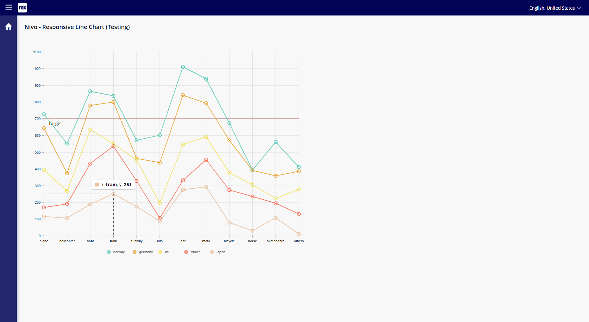

## Nivo Responsive Line Chart
Responsive Line chart ported from the Nivo charts library.

## Features
- Responsive, occupies width and height of parent container.
- More customization options.
- Theming support.
- Data is based on JSON, doesn't use mendix objects.

## Usage
Just download from the marketplace.
Will be readily usable, no extra configuration required.

## Demo project
Will be coming in future :)

## Issues, suggestions and feature requests
> Issues: https://github.com/Eessh/mendix-nivo-responsive-line-chart/issues

> Pull Requests: https://github.com/Eessh/mendix-nivo-responsive-line-chart/pulls

## Screenshots

## Development and contribution

1. Install NPM package dependencies by using: `npm install`. If you use NPM v7.x.x, which can be checked by executing `npm -v`, execute: `npm install --legacy-peer-deps`.
1. Run `npm start` to watch for code changes. On every change:
    - the widget will be bundled;
    - the bundle will be included in a `dist` folder in the root directory of the project;
    - the bundle will be included in the `deployment` and `widgets` folder of the Mendix test project.
